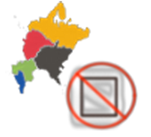
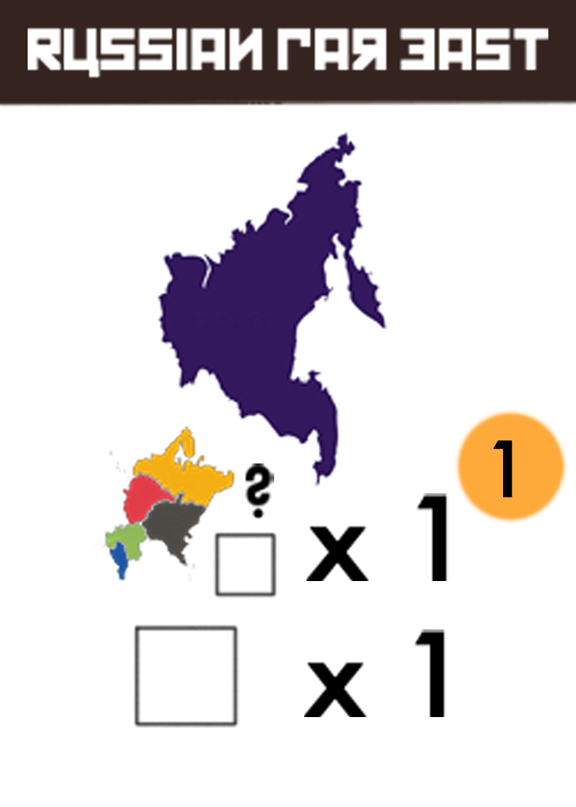

# Asean 2090, Billionares without Borders
At the dawn of major technological advancement, major investment firms provide offerings to the world's first precognition robot to have a competitive edge on finance booms in the coming quarter.

Players will assume the roles of investment banks that speculate on the values of industries in the countries of the ASEAN organization. As these bank, players will bid for turn order, select actions in the auctioned turn order, and take part in lavish mergers. At the end of the round, players will earn credits and resources depending on how much influence they have in each of the nine areas.

The game ends at the end of the round when one player has placed all twenty of their influence markers on the board. At that time, the player with the most credits behind their player screen is deemed the most likely to influence russian politics after the collapse of the USSR, and is therefore the winner.

## Rules of play

A round of Nomenklatura is played in four phases:
1. Agenda Phase
2. Execution Phase
3. Merger Phase
4. Scoring Phase

# Agenda Phase

During the Agenda phase, players will bid for preferential access to the precognition bot. Players will proceed in turn order from the last round, and make one bid. Players may bid any amount, including less than the current highest bid or none at all. All bids are payed to the bank, and players re-arrange the new turn order in order of highest bid to lowest bid. If two players are tied in their bids, then the respective order of the last round is maintained.

# Execution phase

During the Execution phase, players will in turn order select and execute agenda cards. These agenda cards will describe the actions that the player will take. After taking the action, the player who took the action will discard the agenda card to a shared a shared discard pile.

Each player will take exactly one agenda card and perform all of the described action(s) that they have the ability to complete. If a player cannot complete some or all of the described actions, either by not meeting the conditional requirement for part of the card or by running out of influence markers, that player can still take that card but only to execute the actions that they can take. 

The actions of agenda cards may not be equal in the value they provide players, nor is it guaranteed that a desired agenda card will be remaining by the time it comes to your turn. It is up to each player to bid aggressively during agenda phase to get preferential turn order during the execution phase.

## Card Anatomy OUT-DATED 

### Each agenda card will have three sections:

1. Name
    - if the agenda card is associated with a specific region, that region's name will printed in this section.
2. Picture
    - Paired with the name to easily identify the region of focus for a particular card. 
3. Description
    - This descibes the actions and *the order of the action(s)* that a player will take if they select this card during execution. Individual actions of a card are resolved from top to bottom.

If a white influence marker is pictured as part of the actions, this indicates that a player will place the amount of influence in the region on the board associated with the card equal to the number printed. 

If an actions describes special placement of influence markers, the player will follow the instructions provided by the card text.

> If a player selects this moscow card during the execution phases, they will place one influence in Ural, and place one influence in Moscow.
> The white influence marker paired with x 1 is representative of a generic action. Most agenda cards will let you place a basic amount in their associated region.

===

In addition, there is a symbol that pictures every western region (Moscow, Central Russia, Southern Russia, Volga, and Northwestern Russia). If that symbol is on an agenda card, or on the board (in the case of Central Russia) then that means the player will place or remove influence in any of those five regions up to the amount printed on the right.

> In the above card example, the player will select two influence in any of the five western regions (Moscow, Central Russia, Southern Russia, Volga, and Northwester Russia). Those two influences will be removed from the board and returned to their players supply.

> Since no white influence marker is printed on the card, the player who selects this card *will not place any influence in Central Russia.*

> In this example, the player who selects this card during the execution phase would place one influence in any of the western regions (Moscow, Southern Russian, Central Russia, Northwestern Russia, and Volga), and then place one influence in the Russian Far East.

## The Merger Card

The Merger Card is a special type of card. It does not display a region in its name, nor does it picture a particular region on the map. Instead the Merger card depicts a zealous effort to consolidate industries owned by multiple players in one region into one *industrial enterprise* under the direct supervision of one player.

The Merger card has four actions, and each action must be able to be completed by the player in order to select the card during the execution phase.

1. If the player is not the last player in turn order, they must pay $3 to the bank.
> Note: the player must be able to pay $3 to the bank, or they cannot take this card.

2. The player moves the Merger marker from where it is currently located to an another country. The marker *must be moved* from where it was previously.

3. The player then places one influence in the region.
> Note: the player must have an influence marker in their supply available for placement in the region where the Merger marker has been placed, or they cannot take this card.

4. Every player with at least one influence marker in an adjacent region may choose to move one influence marker from the adjacent region to the region with the Merger marker. This selection is done in turn order.

## End of an Execution Phase

After everyone has taken an agenda card and performed its actions, there should be one agenda card leftover. If the card is a regular agenda card with a region associated with it, it is discarded normally at the beginning of the next agenda phase. If it is the Merger Card, it will remain in the agenda area.

# Merger Phase

### The Merger phase only occurs if the Merger Card was chosen.

When the Merger card is played in the Enterprise Phase, it marks the region with the marker as the site of a large scale effort to merge multiple industries (the different influence markers of players in the region) into one enterprise held by one player.

A Merger occurs if two conditions are met:
1. The Merger Card has to have been played in the execution phase of the same round.
2. The zone must have influence markers of any number from at least two different players. 

In other words, the Merger Card must have been played, **AND** there must be at least two different players' influence markers present after all actions during the execution phase have been taken. The second condition can be broken by other players removing influence from the region with the Merger Marker.

## Redistribution

When a region is marked for Merger, players will follow these steps:

### 1. The Player in turn order creates the merger track

The current first player in turn order will collect all markers from the different players, and place each individual marker in one space of the merger track in any order. There is no limit to the amount of influence that can be placed in a region and on the merger track. If the first player runs out of spots to put influence on the merger track, they can simply place them to this side of the board in a continuing line.

### 2. In turn order, players will bid to win the Merger.

Bidding will begin with the first player in turn order, then followed by the second player, etc.

Players will declare an amount of credits that they are willing to bid. Bidding will continue in turn order until all but one player has passed. When placing a bid, a player must declare a bid higher than the previous bid in order to remain in the auction. Players who pass earlier in the auction cannot re-enter.

A player cannot bid more than they have, as we will see during *Payout.*

### Payout

When a player has won the bid, that player distributes credits along the merger track by placing one credit on the first space, then the second, third, etc. Once the the winning player has placed a credit on the rightmost space marked by an influence marker, the player resumes the payout by starting over on space 1 of the merger track, then space 2, space 3, etc. This continues until the winning player has paid out credits equal to their bid. 

All players then take credits that were placed in spaces of influence markers that they own, including the winning player. After that influence markers of opposing players who did not win the bid are "converted" to influence markers controlled by the player who won the merger auction, and are placed back on the board. The total amount of influence markers placed by the winning player will almost always be equal to the total amount of influence markers that were in the country at the beginning of the merger phase.

The one exception is the 'Contingencies in Place' event card  which negates conversion of a losing player's influence markers after a merger.

The Merger phase ends after all described actions have been taken.

# Production Phase

The Production Phase is the last phase of every round.

During this round, every player scores an amount of credits in each region according to these rules:

- The player with the most amount of influence in a region receives one credit for every influence marker in that region. This includes influence markers of other players.

- The player with the second most influence markers a region receives one credit for every influence marker they own in that region.

- If a player is the only player in a region, often as the result of a Merger, they receive two credits for every marker they have in that region.

- If there is a tie for player with the most amount of influence in a region, all players who are tied receive credits as if they held the second most influence in the region.

- If there is a tie for second most influence in a region, all players who are tied receive credits as if they normally held second most influence in the region - $1.

- If a player gets to either the Russian Far East or Siberia, Each player who scores receives an additional 4 credits. However, in order to score these areas, a plaayer must be a majority leader in one of the western regions.

After scoring, players in turn order may pay 1 credit to the majority leader of the phillipines to move one cube to the right along the railroad.

# End of Game

The End of Game is triggered when one player has placed all fifteen of their influence on the board. Scoring occurs one more time (effectively double scoring the last round of the game).

Players then reveal their credits they earned throughout the game, and the player with the most wins.

If there is a tie, the player who has the most influence remaining in their supply wins instead.

If there is still a tie, then all players who tied share a delight in their equal potential to influence Russia to their whim in the aftermaths of the Cold War.

