# Atrades, Speculators of the desert planet

The year.... has not been invented yet for this game occurs long before the time of the earthlings. But during this time the sentient beings of the galaxy discovered a bountiful planet of resources, Atrades. This sparked a spice rush as plutocrats and commoners alike flocked to the desert planet, hearts heavy with hope and greed. Players will play as space guilds kickstarting companies on Atrades in hopes of selling it off to the budding Atrades Government or other players for personal profit. Players will start companies along the habitable regions of Atrades. These companies will grow and eventually turn into branching cities, or be added to the portfolios of other space guilds' companies.

The space guild at the end of the game with the most money wins, but its important to keep in mind the steep bureacratic nature of galactic regulation. Money in a company's bank is separate from your money, and only your money counts when the game is over. 

## Components!

Before diving into the rules, it would be best to briefly describe the components that players will be manipulating throughout the game.

### Guild board and Action Cubes

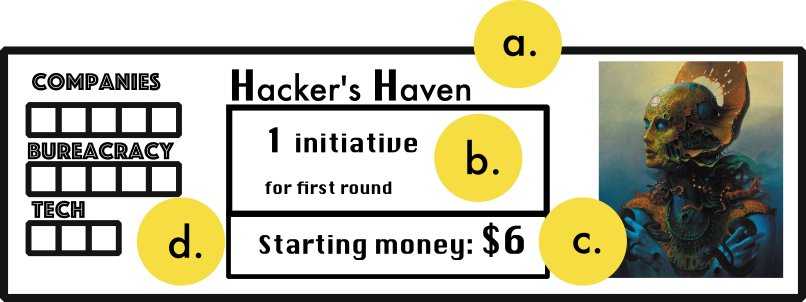

At the start of the game, players will pick one of the five different space guilds. 
These space guilds will display:

- a. your guild's name
- b. your starting initiative, 
- c. your starting money,
- d. the three actions tracks that you will fill as you take actions. 

Action Cubes represent the amount of actions you can have before the game ends. All players will start at 8 actions (and therefore the game will last a maximum of 8 turns). On your turn when you take one of the three primary actions, you will also place one of your cubes on the track associated with that action.

### Regions 

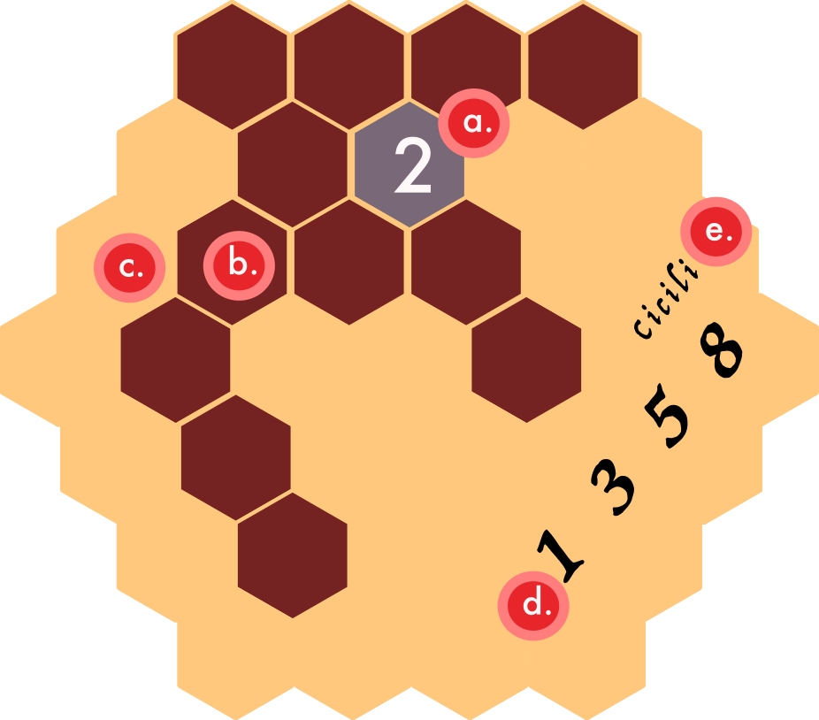

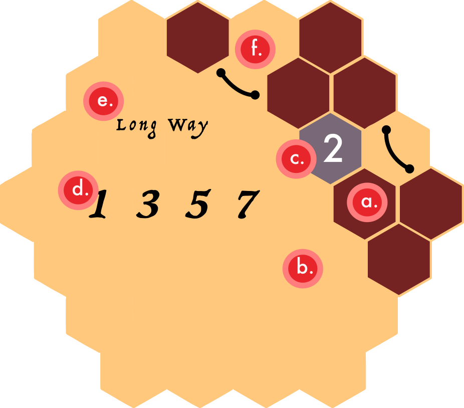

The regions of Atrades are represented by hex grids that are chosen at random during setup.

Each region will have some or all of these characteristics:

- a. Habitable land, these dark brown hexes are where players may place company pieces.

- b. Desert, the tan area surrounding dark brown hexes are totally desolate. Players cannot place company pieces in the desert.

- c. Cities, light grey tiles with numbers at the center are cities. Players with companies adjacent to cities will be able to sell their company to the city once they have the necessary level of bureacracy. However, players may not place company pieces ontop of the city space.

- d. Demand track, this will display the total amount of goods that can be scored during the scoring phase. Demand will go up whenever multiple companies *start* in the same region, but **will never go down even if a company's starting tile is consumed during a merger.**

- e. Region Name, this provides no gameplay effects but is what the region is referred to for the people of Atrades.

#### Adjacency

- f. In some cases, black lines with nodes on each end will connect to different habitable lands(a.) across the desert(b.). For all purposes, habitables connected this way are considered adjacent in all aspects.

### Company Tiles

Company tiles are the pieces that will be placed on regions as companies begin and grow across Atrades. There are four types of comapnies in Atrades:

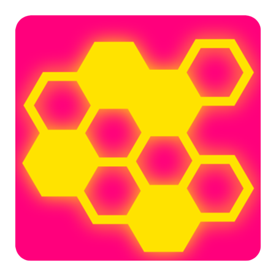

**Rations** x 20

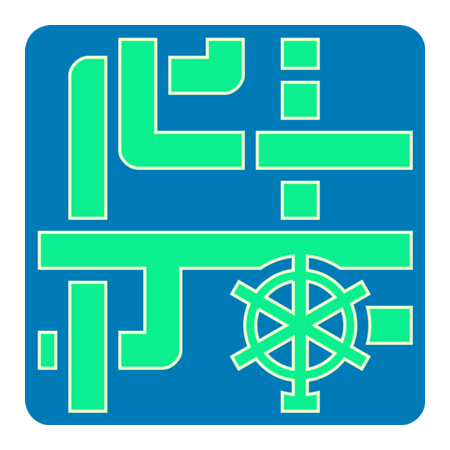

**Liquids** x 19

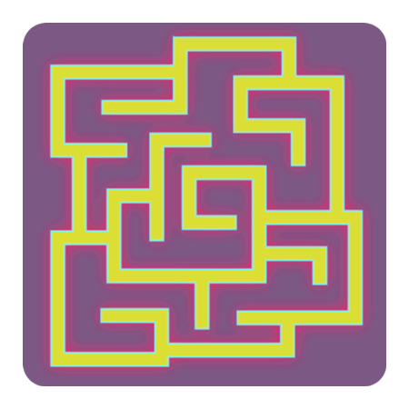

**Wiring** x 20

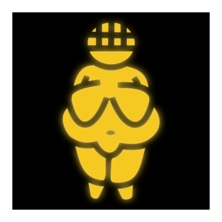

**Spice** x 19

#### Starting Company tiles

Starting company tiles are the tiles that players will initially place when starting a company.

There are starting company tiles for each company type. Starting companies are differentiated from regular company tiles by having a number next to the company type symbol. This is the iniative of that company that will be added to a Player's iniative total at the beginning of every round. 

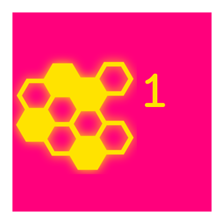

**Rations** : 1 - 5 initiative

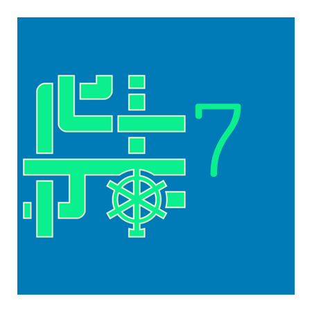

**Liquids** : 6 - 9 initiative

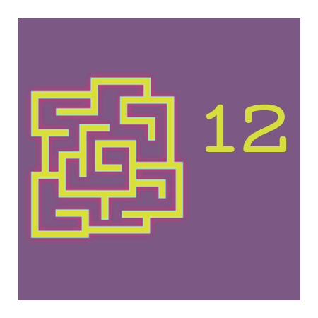

**Wiring** : 10 - 14 iniative

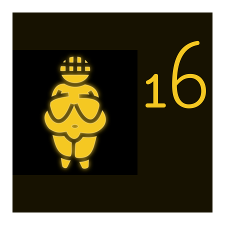

**Spice** : 15 - 18 iniative

### Company Banks and Money

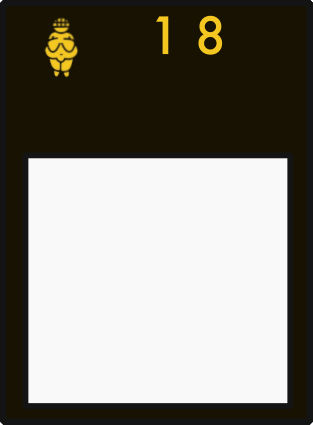

Whenever a player starts a company, they will also take the company bank matching the initiative of the starting company tile from the supply.

Company tiles have three characteristics:

- a. *iniative*, this number will be added to the initiative total of the player who owns this company during the turn order phase.
- b. *type symbol*, this serves as a reminder of what type of company this is.
- c. c*ompany bank*, this is the area where all income from a company will be stored. Money placed here is kept separate from a player's personal bank or banks of other companies until a merger results in money being exchanged between players and companies.

## Rules of play

A round of Atrades is played in three phases:
1. Turn Order
2. Action
3. Scoring

# Turn Order

**NOTE: This phase is skipped during the first turn**

During the turn order phase, players will sum The initiative of their companies together. Then players will reorder the turn order track in order from least to greatest. If two players' initiative totals are tied, their respective turn order is kept.

Once the turn order has been re-ordered, the game will continue to the Action phase!

# Action

## Scoring

The Production Phase is the last phase of every round.

During this round, companies will receive income from the goods they sell to Atrades

- The player with the most amount of influence in a region receives one credit for every influence marker in that region. This includes influence markers of other players.

- The player with the second most influence markers a region receives one credit for every influence marker they own in that region.

- If a player is the only player in a region, often as the result of a Merger, they receive two credits for every marker they have in that region.

- If there is a tie for player with the most amount of influence in a region, all players who are tied receive credits as if they held the second most influence in the region.

- If there is a tie for second most influence in a region, all players who are tied receive credits as if they normally held second most influence in the region - $1.

# End of Game

