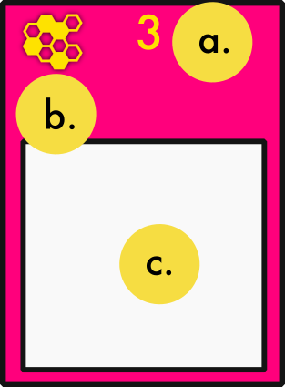

# Atrades, Speculators of the desert planet

The year.... has not been invented yet for this game occurs long before the time of the earthlings. But during this time the sentient beings of the galaxy discovered a bountiful planet of resources, Atrades. This sparked a spice rush as plutocrats and commoners alike flocked to the desert planet, hearts heavy with hope and greed. Players will play as space guilds kickstarting companies on Atrades in hopes of selling it off to the budding Atrades Government or other players for personal profit. Players will start companies along the habitable regions of Atrades. These companies will grow and eventually turn into branching cities, or be added to the portfolios of other space guilds' companies.

The space guild at the end of the game with the most money wins, but its important to keep in mind the steep bureacratic nature of galactic regulation. Money in a company's bank is separate from your money, and only your money counts when the game is over. 

## Components!

Before diving into the rules, it would be best to briefly describe the components that players will be manipulating throughout the game.

### Guild board and Action Cubes

At the start of the game, players will pick one of the five different space guilds. 
These space guilds will display:

- a. your guild's name
- b. your starting initiative, 
- c. your starting money,
- d. the three actions tracks that you will fill as you take actions. 

Action Cubes represent the amount of actions you can take in a game. All players will start at 7 actions (and therefore the game will last around 7 turns). On your turn when you take one of the three primary actions, you will also place one of your cubes on the track associated with that action.

The game ends at the end of a round where a player runs out of action cubes, or when there are no more companies left to acquire.

### Regions 

The regions of Atrades are represented by hex grids that are chosen at random during setup.

Each region will have some or all of these characteristics:

- a. Habitable land, these dark brown hexes are where players may place company pieces.

- b. Desert, the tan area surrounding dark brown hexes are totally desolate. Players cannot place company pieces in the desert.

- c. Cities, light grey tiles with numbers at the center are cities. Players with companies adjacent to cities will be able to sell their company to the city once they have the necessary level of bureacracy. However, players may not place company pieces ontop of the city space.

- d. Demand track, this will display the total amount of goods that can be scored during the scoring phase. Demand will go up whenever multiple companies *start* in the same region, but **will never go down even if a company's starting tile is consumed during a merger.**

- e. Region Name, this provides no gameplay effects but is what the region is referred to for the people of Atrades.

#### Adjacency

- f. In some cases, black lines with nodes on each end will connect to different habitable lands(a.) across the desert(b.). For all purposes, habitables connected this way are considered adjacent in all aspects.

### Company Tiles

Company tiles are the pieces that will be placed on regions as companies begin and grow across Atrades. There are four types of comapnies in Atrades:

|  | |  | 
| --- | --- | --- | --- |
| **Rations** x 20 | **Liquids** x 19 | **Wiring** x 20 | **Spice** x 19 |

#### Starting Company tiles

Starting company tiles are the tiles that players will initially place when starting a company.

There are starting company tiles for each company type. Starting companies are differentiated from regular company tiles by having a number next to the company type symbol. This is the iniative of that company that will be added to a Player's iniative total at the beginning of every round. 

|  | |  | 
| --- | --- | --- | --- |
| **Rations** : 1 - 5 initiative | **Liquids** : 6 - 9 initiative | **Electricity** : 10 - 14 iniative | **Artifacts** : 15 - 18 iniative |

### Company Banks and Personal Assets

Whenever a player starts a company, they will also take the company bank matching the initiative of the starting company tile from the supply.

Company tiles have three characteristics:

- a. *iniative*, this number will be used to determine the order in which companies sell during the market phase. This number also identifies the owner of that company.
- b. *type symbol*, this serves as a reminder of what type of company this is.

## Rules of play

A round of Atrades is played in Four phases:
1. Turn Order
2. Action
3. Market
4. End of Round

# Turn Order

During the turn order phase, players will make simultaneous sealed bids from money hidden in their closed first. The player who bids the most is placed in the first player spot, second most is placed in the second spot, etc.

The money bid for turn order may only come from one company card of a player's choice and/or their personal vp supply.

All bid amounts are placed back in the suppy.

Once the turn order has been re-ordered, the game will continue to the Action phase!

# Action

During a player's turn, they may take any of these three actions:

1. Acquire
2. Merge
3. Research

## Acquire

A player may spend a cube to take one of the available starting tiles for a company. In doing so, the player will place this starting tile on any available space on a map tile. The player then raises the demand marker one space on the demand track on the map tile that the marker was placed on.

## Merge

The merge action is by far the most intricate and compelling action a player can take. There are two types of mergers that you can take when taking a merger action: *Player mergers* and *Atrades Govt. Mergers*. Either type of merger of you take will be the primary way by which players convert money on company cards into victory points hidden in their supply.

## Player Merger

At the beginning of a merge action the active player has the option to place an action cube on the merger track from their own supply, or take the action without placing one. If they choose not to place an action cube, they may get one action cube placed on their bureacracy track from the supply instead, but only if they win the ensuing auction for the merger, or the winning player chooses to take a free action cube placement as well.

In either event, the active player identifies a company they own and a company directly adjacent to it on the board as the targets of this merger. In selecting these, an auction will begin, and the player who wins it will receive the combined company assets of those companies. 

Before the auction begins, the player(s) whose companies have been merged will each place an amount of cubes on the auction track equal to the amount of spaces their target company takes on the board. The placement will go as follows: the first cube is placed by the player that started the auction. Then (assuming the other targeted company is owned by another player) the other player places a cube down for one of their spaces. Then the player who initiated the auction places another cube for one of their company's space, etc. This continues until players have taken turn placing cubes until they have both placed cubes on the track equal to the amount of spaces their respective companies take. If a player's company takes more spaces than anothers, that player will simply place their cubes on the track after the other player has concluded placing cubes for their smaller company.

Then the player who began the auction will notify the other players how many rounds there will be in the auction. The amount of rounds in an auction is equal to the number of levels between the two companies added together.

Then the auction starts with the player to the left of the player who declared the merger. The first player has the option to place a starting bid that is at least equal to 1 dollar for every cube on the auction track, or pass. After the first player, the auction continues in clockwise order with each player having the option to either raise from the previous bid, or pass. If a player passes, they are out for the rest of the auction.

*NOTE:* A player may not bid more than the total amount of money they have between their personal supply and *one* company's assets of their choice. This will be explained in more detail later in the payout subsection.

 This process will continue until either all players but one have passed, or until more than one player has made it to the final round of the auction.

If more than one player has made it to the final round of the auction, all players still remaining in the auction will make a final bid by hiding an amount of money greater than the last bid of the previous round in their fists. Then these sealed bids are revealed simultaneously in front of all other players and the highest bid wins!

### Payout

In the event that either a players wins by placing the highest bid during the last round of bidding, or by being the last remaining player after all other players have passed prior to the last round of bidding, the winnning player must payout their bid on the auction track.

The winning player does so by placing one dollar on each space where a player's cube was placed from left to right. Once a player places a dollar on the space sharing the rightmost cube on the auction track, they will continue placing dollars on the auction track starting from the leftmost space again. The money that a player uses for this auction must come from only *one* company card of their choice in their play area and/or their personal vp supply. This process will continue until the player has placed an amount of money on the track equal to their bid.

Then if a player has lost control of one of their companies due to this merger action, that player will take all money on spaces on the auction track that share the same space with one of their cubes. This money goes directly to their personal vp supply. Then that player has the option to take a free Acquire Action from the supply of available companies without using an action cube. If the auction resulted in two players losing control of their companies, then free Acquire Actions are taken in turn order.

If a player won an auction in which their own company was targeted (including the company of a player who started the auction), they will remove whatever previous money may be sitting on that company's asset card, and replace it with the money on spaces on the auction track that shares the same space with their own cube(s). Then the assets of the targeted company of the player who lost the bid are turned into the same type as the winning player's company on the board, swapping out each company area for one of the winning company's type.

*NOTE:* a player who had a company that was targeted during the merger may win a bid and payout the bid from a company that wasn't a part of the merger. In this case, the company that was targeted still has its money on its company assets replaced with the money from the card.

If a player won an auction in which neither target company was owned by them, then that player simply receives the combined company areas of each company on the board, and gets to decide which type of company it will be between the two companies that were targeted, swapping out one of the companies for the type of the other of the winning player's choice on the board.

The last thing that the winning player does is decide whether they want to take an action cube from the supply and place it on their bureacracy track for free. If the winning player decides to take an action cube this way, the player who initiated the auction may also take a free action cube from the suppy and place it on their bureacracy track if they did not place one there already at the beginning of the merger action. 

*NOTE:* if you started the merger action, and didn't place an action cube at the beginning, you may only place one cube from the supply on the bureacracy track.

## Atrades Govt. Merger

Instead of taking a player merger action where money is exchanged between players and bid portions are paid out as Victory points to the player(s) who lost control of companies, a player may take an *Atrade Govt. Merger* action where the player sells their company directly to the Atrades Government.

In order to do so, a player has to identify a company that they own that is directly a adjacent to a city space (a grey numbered hexagon on a map tile) and have an amount of cubes on the bureacracy track equal to or greater than the number on that city space.

When they take that action, they must place an action cube from their supply on the bureacracy track. Then a merger begins whereby a player exchanges as much money as they can from their target company's card for a set amount of victory points detailed on this chart.

| **Accumulation Disperson** | **Atrades Govt. Payout** |
| 25 | 11 |
| 25 | 9 |
| 15 | 7 |
| 7 | 5 |
| 3 | 3 |

The active player startes from the top and moves down to the bottom. At each slot, if they have an amount of money on their company card equal to or greater than the amount in the left column, they put the amount of money in the left column of that slot back in the supply, and receive the amount of victory points on the right. If a company's card doesn't have enough money to reach the amount of the accumulation dispersion, the player skips that row and continues normally at the next.

This continues until the last row (the one in which a player directly trades three money for three victory points), and all other remaining money on the company card is returned to the supply.

Then the spaces on the map for the company are flipped over. That company will no longer sell goods, but its spaces will still be taken up by the flipped over company tiles.

### Payout

## Research

Players may spend a cube to take one of the available technology cards from the supply so long as it meets the era requirement. Technology cards marked era 1 are available from the beginning of the game, and technology cards can only be taken if you are in the second era or third era of the game.

Technology cards will have a cost printed in the top right. This cost can be paid from your personal vp supply, and/or *one* company's assets.

Whenevever you take a technology card, that card's effects resolve immediately.

# Market

The Production Phase is the last phase of every round.

During this round, companies will receive income from the goods their companies sell to the people of Atrades

The order in which companies sell to the people of atrades is in order of initiative from lowest to highest, starting at 1 and concluding at 18.

The company with the lowest initiative number that hasn't sold yet will sell goods tile by tile until they have either sold an amount of goods equal to the spaces they take up on the map tile being resolved, OR until the demand amount has been reached. The demand amount is equal to the number the demand marker is on for each map tile. No combination of companies on a single map tile may sell more than the number marked by the demand marker.

For each good a company sells, that company will receive an amount of money equal to that good's cost. This money is placed on that company's asset card.

If a company has sold all goods it could sell, ie it has sold an amount of goods equal to the total number of spaces it takes on the map, then it will get to expand! The player who owns that company will get to place a new company space on the board directly adjacent to a 

# End of Round

At the end of every round, the remaining starting company tiles are checked to see if the next round will

# End of Game

