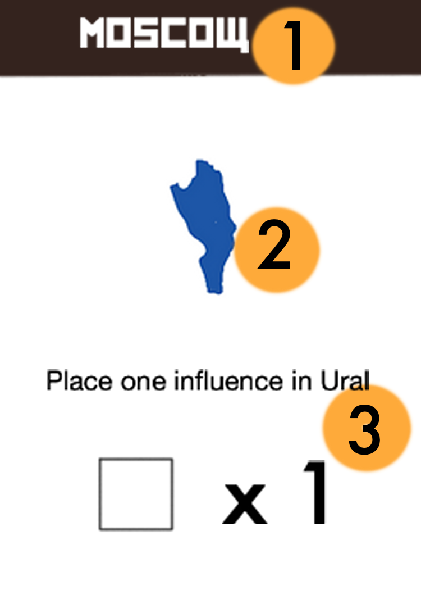
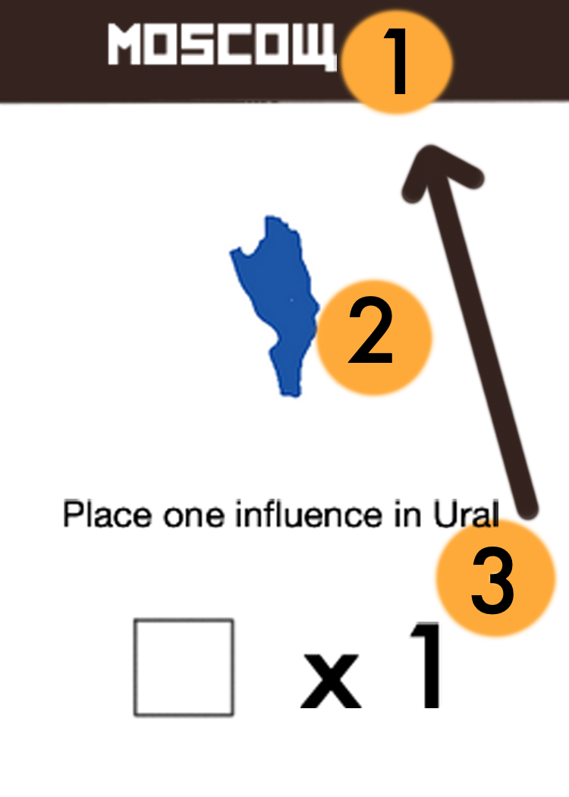
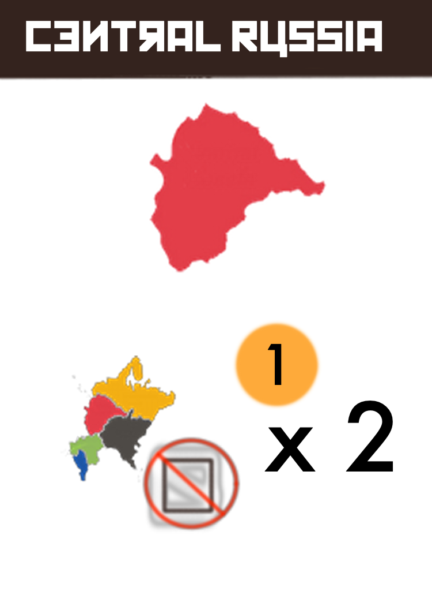

# Nomenklatura
Board Game prototyping for a socialism-themed area control game.

Players will assume the roles of influential nobles and elites that ran the enterprises of the Soviet Union. As these Nomenklatura, players will bid for turn order, select actions in the auctioned turn order, and take potentially powerful enterprise actions. At the end of the round, players will earn rubles depending on how much influence they have in each of the eight areas.

The game ends at the end of the round when one player has placed all twenty of their influence markers on the board. At that time, the player with the most rubles behind their player screen is deemed the most likely to influence russian politics after the collapse of the USSR, and is therefore the winner.

## Rules of play

A round of Nomenklatura is played in four phases:
1. Agenda Phase
2. Execution Phase
3. Consolidation Phase
4. Shipping Phase

# Agenda Phase

During the Agenda phase, players will receive formal orders from Moscow on how to sculpt the industry Soviet Union. These policies and commands come in the form of action cards that will describe the actions a player will take when selecting it during the Executive phase. Then players will pay each other 

Discard any action cards leftover from the previous round. Then re-fill the agenda by flipping over cards from the agenda deck and placing them at the top of the board. The amount of cards that will be flipped over during this round is  1 plus the amount of players, so that even that the last player to take an action will two options.

After re-filling the agenda, players will bid for turn order. This is done by bidding an amount of rubles greater than the previous bid and devoting that amount to the bidding track. When you devote rubles to the bidding track, you will start with the player space to the right of the the last ruble placed by the player who bid before you. You will place one ruble in that player space, place another ruble to the right of that player space, and continue to place rubles in this fashion until you have devoted an amount of rubles equal to your declared bid. 

You can and will place rubles in your own space during this process. You will only places rubles in player spaces where there are active players, exa. only use players spaces 1,2, and 3 if you are playing with three players. If you come to the rightmost player space, and still have remaining rubles to devote, you will continue at the leftmost spot of the bidding track.

Bidding will start with the current turn order that was determined during the preevious rounds agenda phase, until all players but one have refused to raise the current bid. If a player is starting the bid, they will place the first ruple to the right of their player space, e.g. if player 2 was the first player in turn order for bidding, they would start by placing their first ruple on the player 3 space.

Turn order for players is then decided from greatest bid to smallest. For example, if player 2 won at 8 rubles, a player 3 passed after bidding 7 rubles, and the the player 1 did not bid at all, then the turn order would be player 2, 3, then 1. players will place player marker in the turn order track to reflect the new turn order with the player with the winning bid placing their marker in the 1 spot, second highest placing in 2, etc.

In addition, each player takes the rubles that were placed on their designated space during the agenda phase, and use them normally as their own rubles for the remainder of the game for bidding on the bidding track and scoring at the end of the game.

# Execution phase

During the Execution phase, players will in turn order select and execute agenda cards. These agenda cards will describe the actions that the player will take. After taking the action, the player who took the action will discard the agenda card to a shared a shared discard pile.

Each player will take exactly one agenda card and perform all of the described action(s) that they have the ability to complete. If a player cannot complete some or all of the described actions, either by not meeting the conditional requirement for part of the card or by running out of influence markers, that player can still take that card but only to execute the actions that they can take. 

The actions of agenda cards may not be equal in the value they provide players, nor is it guaranteed that a desired agenda card will be remaining by the time it comes to your turn. It is up to each player to bid aggressively during agenda phase to get preferential turn order during the execution phase.

After everyone has taken an action, there should be one agenda card leftover that will be discarded during the proceeding Agenda phase. 

## Card Anatomy

### Each agenda card will have three sections:

1. Name
    - if the agenda card is associated with a specific region, that region's name will printed in this section.
2. Picture
    - Paired with the name to easily identify the region of focus for a particular card. 
3. Description
    - This descibes the actions and *the order of the action(s)* that a player will take if they select this card during execution. Individual actions of a card are resolved from top to bottom.

If a white influence marker is pictured as part of the actions, this indicates that a player will place the amount of influence in the region on the board associated with the card equal to the number printed. 

If an actions describes special placement of influence markers, the player will follow the instructions provided by the card text.

> If a player selects this moscow card during the execution phases, they will place one influence in Ural, and place one influence in Moscow.
> The white influence marker paired with x 1 is representative of a generic action. Most agenda cards will let you place a basic amount in their associated region.

In addition, there is a symbol that pictures every western region (Moscow, Central Russia, Southern Russia, Volga, and Northwestern Russia). If that symbol is on an agenda card, or on the board (in the case of Central Russia) then that means the player will place or remove influence in any of those five regions up to the amount printed on the right.

> In the above card example, the player will select two influence in any of the five western regions (Moscow, Central Russia, Southern Russia, Volga, and Northwester Russia). Those two influences will be removed from the board and returned to their players supply.

> Since no white influence marker is printed on the card, the player who selects this card *will not place any influence in Central Russia.*

