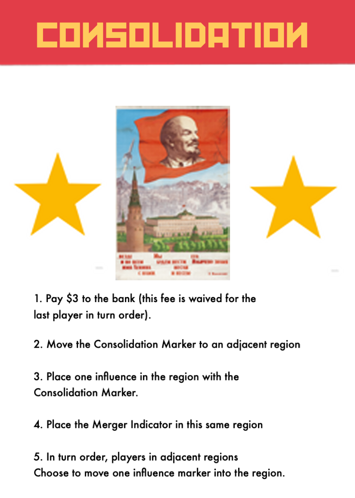

# Nomenklatura
Board Game prototyping for a socialism-themed area control game.

Players will assume the roles of influential nobles and elites that ran the enterprises of the Soviet Union. As these Nomenklatura, players will bid for turn order, select actions in the auctioned turn order, and take potentially powerful enterprise actions. At the end of the round, players will earn rubles depending on how much influence they have in each of the eight areas.

The game ends at the end of the round when one player has placed all twenty of their influence markers on the board. At that time, the player with the most rubles behind their player screen is deemed the most likely to influence russian politics after the collapse of the USSR, and is therefore the winner.

## Rules of play

A round of Nomenklatura is played in four phases:
1. Agenda Phase
2. Execution Phase
3. Consolidation Phase
4. Scoring Phase

# Agenda Phase

During the Agenda phase, players will receive formal orders from Moscow on how to sculpt the industry Soviet Union. These policies and commands come in the form of action cards that will describe the actions a player will take when selecting it during the Executive phase. Then players will pay each other 

Discard any action cards leftover from the previous round. Then re-fill the agenda by flipping over cards from the agenda deck and placing them at the top of the board. The amount of cards that will be flipped over during this round will be equal to the amount of players plus the Consolidation Card. If the deck runs out at any point during re-filling the agenda, the discard pile is shuffled and becomes the new Agenda deck, giving the opportunity for cards played earlier in the game to be played again. **The only exception to refilling the deck is that the Consolidation Card is never shuffled into the deck.** It is always placed in the agenda after the other cards have filled it, so that even that the last player to take an action will two options.

After re-filling the agenda, players will bid for turn order. This is done by bidding an amount of rubles greater than the previous bid and devoting that amount to the bidding track. When you devote rubles to the bidding track, you will start with the player space to the right of the the last ruble placed by the player who bid before you. You will place one ruble in that player space, place another ruble to the right of that player space, and continue to place rubles in this fashion until you have devoted an amount of rubles equal to your declared bid. 

You can and will place rubles in your own space during this process. You will only places rubles in player spaces where there are active players, exa. only use players spaces 1,2, and 3 if you are playing with three players. If you come to the rightmost player space, and still have remaining rubles to devote, you will continue at the leftmost spot of the bidding track.

Bidding will start with the current turn order that was determined during the preevious rounds agenda phase, until all players but one have refused to raise the current bid. If a player is starting the bid, they will place the first ruple to the right of their player space, e.g. if player 2 was the first player in turn order for bidding, they would start by placing their first ruple on the player 3 space.

Turn order for players is then decided from greatest bid to smallest. For example, if player 2 won at 8 rubles, a player 3 passed after bidding 7 rubles, and the the player 1 did not bid at all, then the turn order would be player 2, 3, then 1. players will place player marker in the turn order track to reflect the new turn order with the player with the winning bid placing their marker in the 1 spot, second highest placing in 2, etc.

In addition, each player takes the rubles that were placed on their designated space during the agenda phase, and use them normally as their own rubles for the remainder of the game for bidding on the bidding track and scoring at the end of the game.

# Execution phase

During the Execution phase, players will in turn order select and execute agenda cards. These agenda cards will describe the actions that the player will take. After taking the action, the player who took the action will discard the agenda card to a shared a shared discard pile.

Each player will take exactly one agenda card and perform all of the described action(s) that they have the ability to complete. If a player cannot complete some or all of the described actions, either by not meeting the conditional requirement for part of the card or by running out of influence markers, that player can still take that card but only to execute the actions that they can take. 

The actions of agenda cards may not be equal in the value they provide players, nor is it guaranteed that a desired agenda card will be remaining by the time it comes to your turn. It is up to each player to bid aggressively during agenda phase to get preferential turn order during the execution phase.

## Card Anatomy

### Each agenda card will have three sections:

1. Name
    - if the agenda card is associated with a specific region, that region's name will printed in this section.
2. Picture
    - Paired with the name to easily identify the region of focus for a particular card. 
3. Description
    - This descibes the actions and *the order of the action(s)* that a player will take if they select this card during execution. Individual actions of a card are resolved from top to bottom.

If a white influence marker is pictured as part of the actions, this indicates that a player will place the amount of influence in the region on the board associated with the card equal to the number printed. 

If an actions describes special placement of influence markers, the player will follow the instructions provided by the card text.

> If a player selects this moscow card during the execution phases, they will place one influence in Ural, and place one influence in Moscow.
> The white influence marker paired with x 1 is representative of a generic action. Most agenda cards will let you place a basic amount in their associated region.

===

In addition, there is a symbol that pictures every western region (Moscow, Central Russia, Southern Russia, Volga, and Northwestern Russia). If that symbol is on an agenda card, or on the board (in the case of Central Russia) then that means the player will place or remove influence in any of those five regions up to the amount printed on the right.

> In the above card example, the player will select two influence in any of the five western regions (Moscow, Central Russia, Southern Russia, Volga, and Northwester Russia). Those two influences will be removed from the board and returned to their players supply.

> Since no white influence marker is printed on the card, the player who selects this card *will not place any influence in Central Russia.*

> In this example, the player who selects this card during the execution phase would place one influence in any of the western regions (Moscow, Southern Russian, Central Russia, Northwestern Russia, and Volga), and then place one influence in the Russian Far East.

## The Consolidation Card

The Consolidationg Card is a special type of card. It does not display a region in its name, nor does it picture a particular region on the map. Instead the Consolidation card depcicts a zealous effort to consolidate industries owned by multiple players in one region into one *industrial enterprise* under the direct supervision of one player.

The Consolidation card has four actions, and each action must be able to be completed by the player in order to select the card during the execution phase.

1. If the player is not the last player in turn order, they must pay $3 to the bank.
> Note: the player must be able to pay $3 to the bank, or they cannot take this card.

2. The player moves the consolidation marker from where it is currently located to an adjacent region. The marker *must be moved* from where it was previously.

3. The player then places one influence in the region.
> Note: the player must have an influence marker in their supply available for placement in the region where the consolidation marker has been placed, or they cannot take this card.

4. Place the Merger indicator in the region with the marker. This indicates that there will be consolidation of industries in that region during the Consoliation phase.

5. Every player with at least one influence marker in an adjacent region may choose to move one influence marker from the adjacent region to the region with the consolidation marker. This selection is done in turn order.

## End of an Execution Phase

After everyone has taken an agenda card and performed its actions, there should be one agenda card leftover. If the card is a regular agenda card with a region associated with it, it is discarded normally at the beginning of the next agenda phase. If it is the Consolidation Card, it will remain in the agenda area.

# Consolidation Phase

### The Consolidation phase only occurs if the Consolidation Card was chosen.

When the Consolidation card is played in the Enterprise Phase, it marks the region with the marker as the site of a large scale effort to merge multiple industries (the different influence markers of players in the region) into one enterprise held by one player.

A Consolidation occurs if two conditions are met:
1. The Consolidation Card has to have been played in the execution phase of the same round.
2. The zone must have influence markers of any number from at least two different players. 

In other words, the Consolidation Card must have been played, **AND** there must be at least two different players' influence markers present after all actions during the execution phase have been taken. The second condition can be broken by other players removing influence from the region with the Consolidation Marker.

## Glorious Redistribution

When a region is marked for consolidation, players will follow these steps:

### 1. Players with influence in those regions will take all influence up from the region except for one. 

the remaining markers will serve as a reminder of who will be paid out at the end of the consolidation. The rest will temporarily go in the players' hands separate from their supply.

### 2. In turn order, players will bid to win the consolidation.

Bidding will be similar to how players bid for turn order. Bidding will begin with the player marked as the first player, then followed by the second player, etc.

Players will declare an amount of rubles that they are willing to bid, and will place those rubles in the same pattern as the turn order bid, placing to the right of the last ruble placed by the player who bid immediately before. If the ruble placement of the bid makes it to the rightmost spot of the bidding track, the next ruble will be placed at the leftmost spot.

### There are two major differences between the Consolidation Bid and Turn Order Bid.

- Rubles are not placed in every player space that designates a player in the game. Instead, Rubles are placed in the next player space *that has an influence marker in the region (left from step 1 of the Consolidation).* This means that if a player is not in the region selected for Consolidation, *they will not have rubles placed on their player space.* If a player were next in the bidding track for the placement of rubles, but was not in the region, there space would simply be skipped. The next placement of the rubles for devoting to the auction would go to the next right space of a player who *is* in the region.

- Players with influence markers that they took from the region selected from Consolidation may use those markers to substitute for rubles while placing payments on the bidding track. Each influence marker is worth one ruble for the sake of placing rubles equal to your decalred bid. This means that if you declared a bid of $8 and had 5 influences markers picked up from the region marked for Consolidation, you would be able to place these five markers in place of rubles and only pay out $3 of your $8. The use of influence markers in this way is temporary, and does not give any resources to other players when rubles are picked up from the track at the end of the bid.

Once a player passes, they cannot re-enter the bid.

If all other players have passed, the player with the highest bid is designated the winner of the auction.

### 3. Once all players have passed, wealth is redistributed

All players take only the rubles that were placed on their player space during the Consolidation phase. Then influence markers that were placed on the track in place of rubles from all players and the rubles that may remain in the winning player's hand after picking them up at the beginning of the round are added together. The added number is the amount of influence markers of the winning player that will be placed back into the consolidated region.

All other influence markers that were picked up during the consolidation phase, ie all influence markers that were picked up by other players but not placed on the bidding track), and the remaining influence of players other than the player who won the bid arae returned to their respective owner's supply.

The Consolidation phase ends after all described actions have been taken.

# The Scoring Phase

The Scoring Phase is the last phase of every round.

During this round, every player scores an amount of rubles in each region according to these rules:

- The player with the most amount of influence in a region receives one ruble for every influence marker in that region. This includes influence markers of other players.

- The player with the second most influence markers a region receives one ruble for every influence marker they own in that region.

- If a player is the only player in a region, often as the result of a consolidation, they receive two rubles for every marker they have in that region.

- If there is a tie for player with the most amount of influence in a region, all players who are tied receive rubles as if they held the second most influence in the region.

- If there is a tie for second most influence in a region, all players who are tied receive rubles as if they normally held second most influence in the region - $1.

# End of Game

The End of Game is triggered when one player has placed all twenty of their influence on the board. Scoring occurs one more time (effectively double scoring the last round of the game).

Players then reveal their rubles they earned throughout the game, and the player with the most wins.

If there is a tie, the player who has the most influence remaining in their supply wins instead.

If there is still a tie, then all players who tied share a delight in their equal potential to influence Russia to their whim in the aftermaths of the Cold War.

